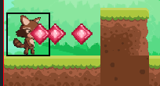
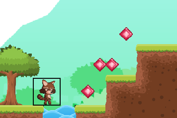

# Upute

U ovom rješenju, pripremljen je primjer pucanja tako da se stvara više od jednog projektila.



Svaki put kad korisnik pritisne tipku za pucanje (u ovom slučaju D), stvara se novi projektil koji ide svojim putem.

Ovdje je važno napomenuti da je napravljena izmjena u **lib-05-game.js** kako bi ta mogućnost bila podržana. Prema tome, preuzmite folder **otter** sa svim datotekama iz ovog primjera!

Ako želimo izbjeći čudno ponašanje projektila kod kolizije s platformama kao na slici (kad projektili odlaze na iduće razine):



onda imamo dva načina rješavanja:

1. dodavanje linije **super.updatePosition();** u *updatePosition()* metodu klase Projektil.
2. detekcija točnog trenutka kolizije s platformama.

Kod primjene prvog načina, projektil ostane aktivan/vidljiv neko vrijeme dok mu ne istekne put (domet). Kod drugog načina nema tog problema.

## Racoon - pucaj

```js
//kod_01-likovi.js, klasa Racoon
  pucaj() {

    //! stvaramo novi objekt projektil
    let p = new Projektil(GAME.getSpriteLayer("projektil"));
    GAME.addSprite(p);

    //! dodajemo ga u poseban popis za lakše praćenje
    p.rbr = Postavke.projektili.length;
    Postavke.projektili.push(p);

    // postavi na poziciju i smjer trenutnog lika
    p.x = this.x;
    p.y = this.y;
    p.direction = this.direction;

    p.put = 0;
    p.visible = true;
    p.move = true;

  }
```

## Projektil

Metoda **updatePostition()** se brine o kretanju projektila. 

### Kretanje

```js
  updatePosition() {
    if (this.move) {

      // ako dodajemo ovu liniju, neka se izvrši prije ostalih!
      super.updatePosition();

      // ovisno o smjeru projektila
      if (this.direction == 90) {
        this.x += 5; // ide desno
        this.put += 5; // povećava put
      }
      else {
        this.x -= 5; // ide lijevo
        this.put += 5; // povećava put
      }

    }
  }
```

### Zaustavljanje

Kod zaustavljanja projektila potrebno je:
* postaviti kontrolnu varijablu "move" na false kako bi *updatePosition()* prestala izvršavati kretanje.
* sakriti projektil (najbolje pozvati metodu *stop()*)

Problem je što u ovom primjeru rješenja imamo mogućnost pucanja s više projektila - stvaraju se kao objekti unutar metode **pucaj()** kod glavnog lika (Racoon).

Svaki novi projektil se mora dodati u popis *sprite-ova* koji priprada aktivnoj mapi: **GAME.activeWorldMap.sprites**.

Prema tome, u nizu stvorenih projektila potrebno je pronaći onaj projektil koji se zaustavlja te ga ukloniti iz popisa (JS metoda *splice*).

Osim toga, imamo i dodatni popis: **Postavke.projektili** kojeg koristimo za provjeru dodira s kutijom tako da je i tu potrebno ukloniti projektil koji se zaustavlja.

Indeksi u ta dva popisa se ne poklapaju pa je potrebno naći usporediti reference.

```js
  stop() {
    this.visible = false;
    this.move = false;

    // popis svih likova u mapi
    let sprites = GAME.activeWorldMap.sprites;

    // izbaci onog koji staje (tako da se više ne crta)
    for (let i = sprites.length - 1; i >= 0; i--) {

      // usporedba refernci
      if (sprites[i] === this) {
        sprites.splice(i, 1); // brisanje i-tog elementa        

        Postavke.ukloniProjektil(this);

        break;
      }
    }

  }
```

Statička metoda za brisanje projektila iz popisa:

```js
// klasa Postavke
static ukloniProjektil(p){
    for (let i = Postavke.projektili.length - 1; i >= 0; i--) {
      if (Postavke.projektili[i] === p) {
        Postavke.projektili.splice(i, 1); // brisanje i-tog elementa       
        console.log("uk");
        break; 
      }
    }
  }
```

### Kolizija projektila s platformama

Ako želimo da nam projektil nestane odmah čim dotakne platformu, onda moramo to omogućiti u trenutku dodira s bilo kojom platformom. Tome će nam poslužiti polje: **collidedPlatform** koje nam vraća informaciju s koje strane je lik dotaknuo platformu: top, bottom, right ili left.

Varijabla *collidedPlatform* predstavlja obično polje (nije svojstvo). Definiramo svojstvo collidedPlatform u klasi Projektil. Međutim, kako neke metode koje crtaju likove koriste osnovnu klasu Sprite koja nema pravo pristupa privatnom polju *#collidedPlatform*, onda ćemo dobiti grešku:

```
Uncaught TypeError: Cannot write private member #collidedPlatform to an object whose class did not declare it at set collidedPlatform
```

Kako ipak ne bi intervenirali u klasu Sprite, koristit ćemo posebnu varijablu s donjom crticom: _collidedPlatform koja će nam poslužiti kao pomoćno polje kako bi prepoznali trenutak promjene vrijednosti, tj. konkretnog dodira projektila s platformom.

Konstruktor klase Projektil:

```js
  constructor(layer) {
    super(layer);
    this.visible = false;
    this.put = 0;
    this.move = true;

    // ne možemo koristiti #collidedPlatform jer će se dogoditi greška
    // klasa Sprite nema svojstvo, a collidedPlatform se koristi na više mjesta
    this._collidedPlatform = "";
  }
```

Svojstvo collidedPlatform:

```js
  get collidedPlatform() {
    return this._collidedPlatform;
  }
  set collidedPlatform(v) {
    // ako dira platformu, onda string nije prazan već se radi o strani s koje je dira
    if (v != "") {
      // zaustavi projektil kad dotakne platformu
      this.stop();
    }

    this._collidedPlatform = v;
  }
```

## Logika igre

Za svaki od projektila je potrebno provjeriti dira li kutiju te ga zaustaviti i sakriti kutiju. Čim jedan dotakne, onda se kutija sakriva. Ostali projektili (ako ih ima) nastavljaju put ili do platforme ili dok im ne istekne domet/put.

```js
  for (let i = 0; i < Postavke.projektili.length; i++) {
    const p = Postavke.projektili[i];
    if(p.touching(Postavke.kutija)){
      p.stop();
      Postavke.kutija.visible = false;
      break;
    }
  }
```

